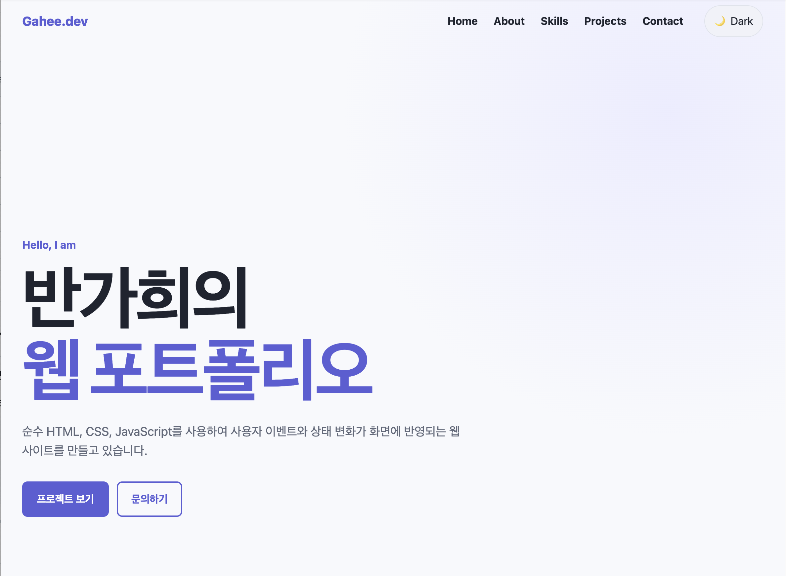
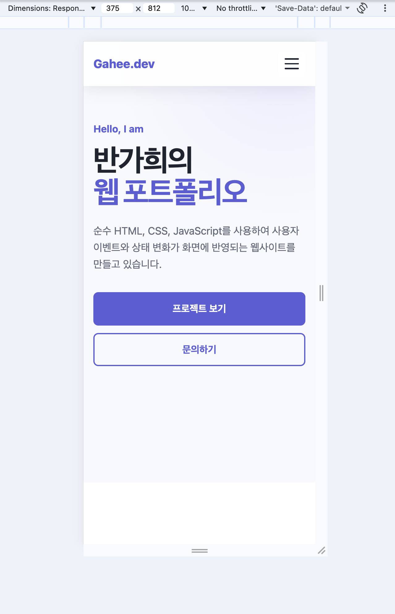
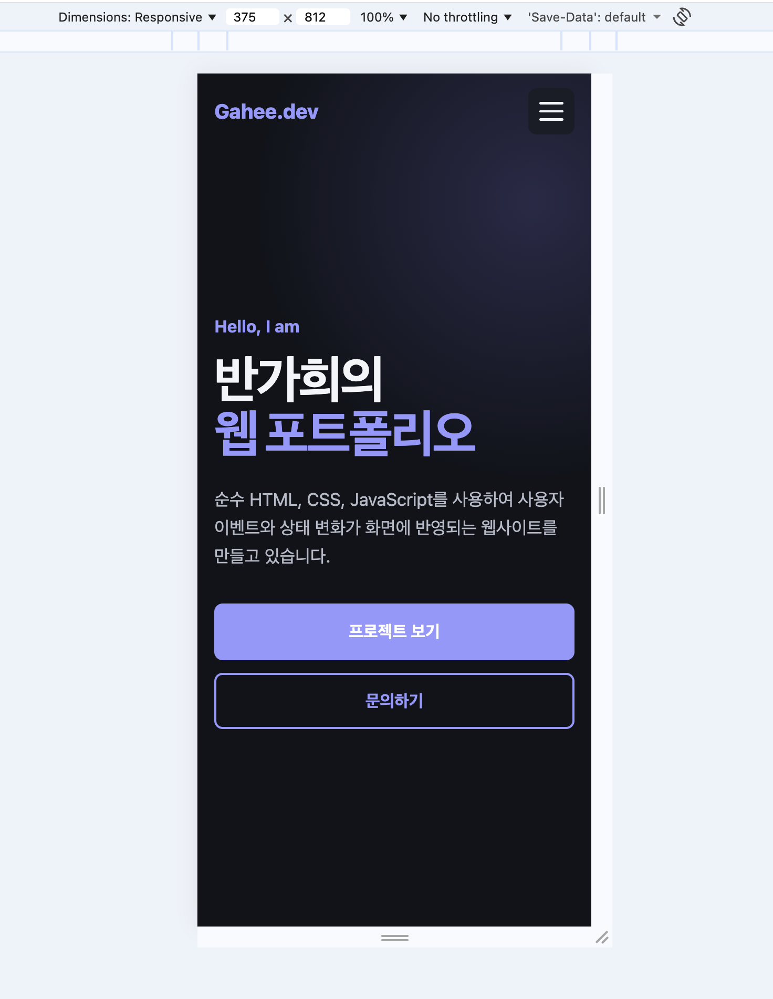

# B4-1 웹 기초 완성: 나만의 포트폴리오 구축

순수 HTML, CSS, JavaScript만으로 구현한 반응형 포트폴리오 웹사이트입니다.

외부 프론트엔드 프레임워크나 UI 라이브러리를 사용하지 않고, 시맨틱 HTML 구조, 모바일 퍼스트 반응형 디자인, DOM 조작, 이벤트 처리, 상태 관리, 폼 유효성 검사와 GitHub API 연동을 직접 구현했습니다.

이 프로젝트의 핵심 동작 흐름은 다음과 같습니다.

```text
사용자 이벤트
→ 상태 변경
→ 렌더링 함수 실행
→ DOM 업데이트
→ 화면 변화
```

---

## 1. 배포 URL

- GitHub Repository: https://github.com/bangahee/B4-1
- GitHub Pages: https://bangahee.github.io/B4-1/

---

## 2. 프로젝트 목표

이 프로젝트는 화면을 단순히 디자인하는 것보다 웹사이트의 기본 동작 원리를 이해하는 것을 목표로 합니다.

특히 다음 흐름을 직접 구현했습니다.

```text
이벤트 발생
→ 애플리케이션 상태 변경
→ 상태에 맞는 렌더링 함수 실행
→ DOM 변경
→ 사용자 화면 업데이트
```

이 과정은 React의 이벤트, state, 렌더링 흐름을 학습하기 위한 기초가 됩니다.

---

## 3. 주요 기능

### 반응형 레이아웃

- 모바일, 태블릿, 데스크톱 화면 지원
- 모바일 퍼스트 방식으로 CSS 작성
- 768px 태블릿 브레이크포인트
- 1024px 데스크톱 브레이크포인트
- 모바일 전체 화면 햄버거 메뉴
- 화면 크기에 따른 Grid와 Flexbox 레이아웃 변화

### 페이지 구성

- Hero
- About
- Skills
- Projects
- Contact
- Footer

### 사용자 인터랙션

- 햄버거 메뉴 열기 및 닫기
- 햄버거 아이콘과 X 아이콘 전환
- 네비게이션 부드러운 스크롤
- 다크 모드 전환
- localStorage를 이용한 테마 설정 유지
- 스크롤 위치에 따른 헤더 스타일 변경
- 맨 위로 가기 버튼
- Intersection Observer 기반 스크롤 애니메이션

### GitHub API

- GitHub 저장소 목록 동적 출력
- 로딩 상태
- 성공 상태
- 에러 상태
- 빈 데이터 상태
- API 재시도 버튼
- 403 API 호출 제한 처리
- 404 사용자 조회 실패 처리
- fork 저장소 제외
- archived 저장소 제외
- 최근 프로젝트 최대 6개 표시

### Contact 폼

- 이름 필수값 검사
- 이름 최소 두 글자 검사
- 이메일 필수값 검사
- 이메일 형식 검사
- 메시지 필수값 검사
- 메시지 최소 열 글자 검사
- 입력 필드 근처 에러 메시지 표시
- 오류 입력창에 `invalid` 클래스 적용
- 첫 번째 오류 입력창으로 포커스 이동
- 정상 제출 시 성공 메시지 표시

---

## 4. 사용 기술

- HTML5
- CSS3
- JavaScript ES6+
- Git
- GitHub REST API
- Local Storage
- Intersection Observer API
- GitHub Pages

React, Vue, jQuery, Bootstrap, Tailwind CSS 등의 외부 프론트엔드 프레임워크나 UI 라이브러리는 사용하지 않았습니다.

---

## 5. 프로젝트 구조

```text
B4-1/
├── index.html
├── README.md
├── .gitignore
├── css/
│   └── style.css
├── js/
│   └── main.js
└── images/
    ├── profile.png
    ├── desktop.png
    ├── mobile.png
    └── dark-mode.png
```

스크린샷 파일을 아직 추가하지 않았다면 현재 구조는 다음과 같을 수 있습니다.

```text
images/
└── profile.png
```

### 파일 역할

- `index.html`: 페이지 구조와 콘텐츠
- `css/style.css`: 디자인, 레이아웃, 반응형 화면, 다크 모드와 애니메이션
- `js/main.js`: DOM 선택, 이벤트 처리, 상태 관리, API 호출과 폼 검사
- `images/`: 프로필 이미지와 제출용 스크린샷
- `README.md`: 프로젝트 설명, 실행 방법, 구현 내용과 평가 준비
- `.gitignore`: GitHub에 올릴 필요가 없는 파일 제외

HTML, CSS, JavaScript를 분리한 이유는 구조, 표현, 동작의 책임을 명확하게 나누기 위해서입니다.

```html
<link rel="stylesheet" href="css/style.css">
<script src="js/main.js" defer></script>
```

`defer`를 사용하면 HTML을 읽는 동안 JavaScript 파일을 함께 다운로드하지만, HTML 구조가 모두 만들어진 뒤 JavaScript가 실행됩니다.

---

## 6. 시맨틱 HTML 구조

페이지 전체를 `div`로만 구성하지 않고 콘텐츠의 의미와 역할에 맞는 시맨틱 태그를 사용했습니다.

- `<header>`: 사이트의 상단 영역
- `<nav>`: 페이지 내부 이동 메뉴
- `<main>`: 페이지의 핵심 콘텐츠
- `<section>`: Hero, About, Skills, Projects, Contact 영역
- `<article>`: 독립적으로 이해할 수 있는 자기소개와 카드
- `<footer>`: 저작권과 외부 링크

```html
<header>
  <nav>...</nav>
</header>

<main>
  <section id="hero">...</section>
  <section id="about">...</section>
  <section id="skills">...</section>
  <section id="projects">...</section>
  <section id="contact">...</section>
</main>

<footer>...</footer>
```

시맨틱 태그를 사용하면 개발자가 문서 구조를 쉽게 이해할 수 있고, 검색 엔진과 스크린 리더도 콘텐츠의 의미를 더 정확하게 파악할 수 있습니다.

---

## 7. 접근성

### 이미지 alt

```html

```

이미지를 볼 수 없거나 스크린 리더를 사용하는 경우에도 이미지의 의미가 전달되도록 `alt` 속성을 작성했습니다.

### label과 입력 요소 연결

```html
<label for="email">이메일</label>

<input
  id="email"
  name="email"
  type="email"
>
```

`label`의 `for`와 입력 요소의 `id`를 일치시켜 label을 클릭해도 해당 입력창에 포커스가 이동하도록 했습니다.

### 모바일 메뉴 접근성

```html
<button
  aria-expanded="false"
  aria-controls="nav-menu"
>
```

JavaScript가 메뉴의 열림 여부에 따라 `aria-expanded` 값을 `true` 또는 `false`로 변경합니다.

### 입력 오류 접근성

```javascript
inputElement.setAttribute(
  "aria-invalid",
  String(errorMessage !== "")
);
```

입력값에 오류가 있는 경우 스크린 리더가 해당 입력이 유효하지 않다는 것을 알 수 있도록 했습니다.

### 상태 메시지

GitHub API 상태 영역에는 `aria-live="polite"`를 사용했고, 폼 제출 성공 메시지에는 `role="status"`를 사용했습니다.

---

## 8. CSS 변수와 다크 모드

반복되는 색상, 간격, 그림자, 전환 속도를 CSS 변수로 관리했습니다.

```css
:root {
  --color-primary: #5b5bd6;
  --color-background: #f8f9fc;
  --color-surface: #ffffff;
  --color-text: #1f2430;
  --spacing-md: 1rem;
}
```

```css
body {
  color: var(--color-text);
  background-color: var(--color-background);
}
```

다크 모드는 같은 변수 이름에 다른 값을 적용하는 방식으로 구현했습니다.

```css
[data-theme="dark"] {
  --color-background: #11131a;
  --color-surface: #1a1d27;
  --color-text: #f4f5f8;
}
```

JavaScript가 `<html>` 요소의 `data-theme` 값을 변경하면 CSS 변수 값이 교체되어 전체 화면의 테마가 변경됩니다.

---

## 9. Flexbox와 Grid

### Flexbox

한 방향으로 요소를 정렬하는 영역에 사용했습니다.

- 네비게이션 로고와 메뉴
- Hero 버튼
- 프로젝트 메타 정보
- Footer 콘텐츠
- 햄버거 메뉴 내부 요소

```css
.navigation {
  display: flex;
  align-items: center;
  justify-content: space-between;
}
```

### Grid

행과 열이 필요한 레이아웃에 사용했습니다.

- About 이미지와 설명
- Skills 카드
- Projects 카드
- Contact 설명과 폼

```css
.projects-grid {
  display: grid;

  grid-template-columns:
    repeat(
      auto-fit,
      minmax(min(100%, 17rem), 1fr)
    );

  gap: 1.5rem;
}
```

`auto-fit`은 화면에 들어갈 수 있는 만큼 열을 자동으로 생성합니다.

`minmax()`는 카드가 최소 너비를 유지하면서 남는 공간을 균등하게 사용하도록 합니다.

```text
한 방향 정렬에는 Flexbox를 사용했고,
행과 열이 필요한 카드 레이아웃에는 Grid를 사용했습니다.
```

---

## 10. 모바일 퍼스트 반응형 디자인

기본 CSS는 모바일 화면을 기준으로 작성하고, 화면이 넓어질 때 필요한 스타일을 미디어 쿼리로 추가했습니다.

```css
/* 기본: 모바일 */
.hero-actions {
  flex-direction: column;
}

/* 768px 이상: 태블릿 */
@media (min-width: 48rem) {
  .hero-actions {
    flex-direction: row;
  }
}

/* 1024px 이상: 데스크톱 */
@media (min-width: 64rem) {
  .menu-toggle {
    display: none;
  }
}
```

### 모바일

- 햄버거 버튼 표시
- 모바일 메뉴가 화면 전체를 덮음
- 카드 한 열
- About와 Contact 세로 배치
- Hero 버튼 세로 배치

### 768px 이상

- About 두 열
- Contact 두 열
- Skills 세 열
- Hero 버튼 가로 배치
- Footer 가로 배치

### 1024px 이상

- 햄버거 버튼 숨김
- 네비게이션 메뉴 가로 배치
- 섹션 여백 확대
- 헤더 blur 효과 적용

모바일 퍼스트를 선택한 이유는 작은 화면의 필수 스타일을 기본으로 작성하고, 큰 화면에서 필요한 변화만 점진적으로 추가하기 위해서입니다.

---

## 11. 모바일 햄버거 메뉴

모바일 메뉴는 현재 스크롤 위치와 관계없이 브라우저 화면 전체를 덮도록 구현했습니다.

```css
.nav-menu {
  position: fixed;

  top: 0;
  right: 0;
  bottom: 0;
  left: 0;

  width: 100%;
  min-height: 100vh;
  min-height: 100dvh;

  background-color: var(--color-surface);
  overflow-y: auto;
}
```

`100dvh`를 사용해 모바일 브라우저의 주소창 크기 변화까지 반영했습니다.

메뉴가 열리면 배경 페이지가 스크롤되지 않도록 했습니다.

```css
body.menu-open {
  overflow: hidden;
}
```

스크롤된 모바일 헤더에는 `backdrop-filter`를 적용하지 않아 전체 화면 메뉴의 위치가 잘못 계산되는 문제를 방지했습니다.

데스크톱 화면에서만 blur 효과를 적용합니다.

---

## 12. DOM 선택과 이벤트 처리

DOM 요소는 `querySelector`와 `querySelectorAll`로 선택했습니다.

```javascript
const themeToggleButton =
  document.querySelector("#theme-toggle");

const navigationLinks =
  document.querySelectorAll(".nav-links a");
```

HTML의 `onclick` 속성은 사용하지 않고 `addEventListener`로 이벤트를 연결했습니다.

```javascript
themeToggleButton.addEventListener(
  "click",
  toggleTheme
);

navigationLinks.forEach((link) => {
  link.addEventListener(
    "click",
    handleNavigationClick
  );
});
```

`addEventListener`를 사용하면 HTML은 구조를 담당하고 JavaScript는 동작을 담당하도록 역할을 분리할 수 있습니다.

이 프로젝트에서 사용한 이벤트는 다음과 같습니다.

- `click`
- `input`
- `submit`
- `scroll`
- `resize`

---

## 13. 상태 관리

현재 화면 상태를 하나의 `state` 객체에서 관리합니다.

```javascript
const state = {
  theme: "light",

  menuOpen: false,

  projects: {
    status: "idle",
    data: [],
    errorMessage: "",
  },

  form: {
    values: {
      name: "",
      email: "",
      message: "",
    },

    errors: {
      name: "",
      email: "",
      message: "",
    },

    submitted: false,
  },
};
```

### 상태 역할

- `theme`: 라이트 또는 다크 모드
- `menuOpen`: 모바일 메뉴 열림 여부
- `projects.status`: API 요청 상태
- `projects.data`: 프로젝트 데이터
- `projects.errorMessage`: API 오류 메시지
- `form.values`: 현재 입력값
- `form.errors`: 필드별 오류 메시지
- `form.submitted`: 제출 성공 여부

상태를 하나의 객체에서 관리하면 현재 화면이 어떤 데이터에 의해 결정되는지 쉽게 추적할 수 있습니다.

---

## 14. 다크 모드 흐름

```text
테마 버튼 클릭
→ toggleTheme()
→ state.theme 변경
→ localStorage 저장
→ renderTheme()
→ data-theme 변경
→ CSS 변수 변경
→ 전체 화면 테마 변경
```

```javascript
const toggleTheme = () => {
  const nextTheme =
    state.theme === "light"
      ? "dark"
      : "light";

  setTheme(nextTheme);
};
```

```javascript
const setTheme = (theme) => {
  state.theme = theme;

  localStorage.setItem(
    "portfolio-theme",
    state.theme
  );

  renderTheme();
};
```

```javascript
const renderTheme = () => {
  const isDark =
    state.theme === "dark";

  document.documentElement.dataset.theme =
    state.theme;

  themeIcon.textContent =
    isDark ? "☀️" : "🌙";

  themeText.textContent =
    isDark ? "Light" : "Dark";
};
```

새로고침 후에도 테마가 유지되는 이유는 localStorage에 저장한 값을 앱 초기화 시 다시 읽기 때문입니다.

---

## 15. 햄버거 메뉴 흐름

```text
햄버거 버튼 클릭
→ toggleMenu()
→ state.menuOpen 변경
→ renderMenu()
→ active 클래스 변경
→ 메뉴 표시 또는 숨김
```

```javascript
const renderMenu = () => {
  navMenu.classList.toggle(
    "active",
    state.menuOpen
  );

  menuToggleButton.classList.toggle(
    "active",
    state.menuOpen
  );

  document.body.classList.toggle(
    "menu-open",
    state.menuOpen
  );

  menuToggleButton.setAttribute(
    "aria-expanded",
    String(state.menuOpen)
  );
};
```

`classList.toggle()`의 두 번째 인자로 Boolean 값을 전달해 상태에 따라 클래스를 추가하거나 제거합니다.

메뉴가 열린 동안에는 `body.menu-open`에 `overflow: hidden`을 적용해 배경 페이지가 스크롤되지 않도록 했습니다.

---

## 16. 부드러운 스크롤

네비게이션 링크의 `href`와 section의 `id`를 연결했습니다.

```html
<a href="#projects">Projects</a>

<section id="projects">
  ...
</section>
```

```javascript
const handleNavigationClick = (event) => {
  const targetId =
    event.currentTarget.getAttribute("href");

  const targetSection =
    document.querySelector(targetId);

  event.preventDefault();

  targetSection.scrollIntoView({
    behavior: "smooth",
    block: "start",
  });

  setMenuOpen(false);
};
```

`event.preventDefault()`로 앵커 링크의 기본 이동을 막고 `scrollIntoView()`로 부드럽게 이동합니다.

모바일 메뉴에서 링크를 클릭하면 이동 후 메뉴도 닫힙니다.

---

## 17. 스크롤 UI

스크롤 위치에 따라 헤더와 맨 위로 가기 버튼을 변경합니다.

```javascript
const HEADER_CHANGE_Y = 60;
const SCROLL_TOP_VISIBLE_Y = 300;
```

```javascript
const updateScrollUI = () => {
  const scrollY =
    window.scrollY;

  siteHeader.classList.toggle(
    "scrolled",
    scrollY >= HEADER_CHANGE_Y
  );

  scrollTopButton.classList.toggle(
    "visible",
    scrollY >= SCROLL_TOP_VISIBLE_Y
  );
};
```

- 60px 이상: 헤더 배경과 그림자 표시
- 300px 이상: 맨 위로 가기 버튼 표시

```javascript
const scrollToTop = () => {
  window.scrollTo({
    top: 0,
    behavior: "smooth",
  });
};
```

---

## 18. 스크롤 애니메이션

Intersection Observer로 요소가 화면 안에 들어오는 시점을 감지합니다.

```javascript
const OBSERVER_THRESHOLD = 0.2;
```

```javascript
const observerCallback = (
  entries,
  observer
) => {
  entries.forEach((entry) => {
    if (!entry.isIntersecting) {
      return;
    }

    entry.target.classList.add(
      "visible"
    );

    observer.unobserve(
      entry.target
    );
  });
};
```

```css
.reveal {
  opacity: 0;
  transform: translateY(2rem);

  transition:
    opacity 700ms ease,
    transform 700ms ease;
}

.reveal.visible {
  opacity: 1;
  transform: translateY(0);
}
```

JavaScript는 `visible` 클래스만 추가하고, 실제 애니메이션은 CSS transition이 처리합니다.

한 번 애니메이션이 실행된 요소는 `unobserve()`를 사용해 더 이상 관찰하지 않습니다.

---

## 19. GitHub API

사용한 API 엔드포인트는 다음과 같습니다.

```text
https://api.github.com/users/bangahee/repos
```

실제 요청에는 최근 수정 순 정렬과 최대 100개 조회를 위한 query parameter를 추가했습니다.

```javascript
const endpoint =
  `https://api.github.com/users/${GITHUB_USERNAME}/repos` +
  "?sort=updated&direction=desc&per_page=100";
```

전체 흐름은 다음과 같습니다.

```text
fetchProjects()
→ loading 상태
→ 로딩 UI
→ fetch 요청
→ 성공 또는 실패
→ success 또는 error 상태
→ 프로젝트 카드 또는 에러 UI
```

```javascript
async function fetchProjects() {
  state.projects.status =
    "loading";

  state.projects.errorMessage =
    "";

  renderProjects();

  try {
    const response =
      await fetch(endpoint);

    const repositories =
      await response.json();

    state.projects.status =
      "success";

    state.projects.data =
      visibleRepositories;
  } catch (error) {
    state.projects.status =
      "error";

    state.projects.data = [];

    state.projects.errorMessage =
      error.message;
  }

  renderProjects();
}
```

`async/await`는 비동기 요청의 흐름을 위에서 아래로 읽기 쉽게 작성하기 위해 사용했습니다.

`try/catch`는 API 요청의 성공과 실패를 구분하고, 오류가 발생해도 프로그램이 중단되지 않도록 하기 위해 사용했습니다.

---

## 20. API 상태별 UI

Projects 섹션은 `state.projects.status`에 따라 다른 UI를 표시합니다.

- `idle`: 요청 전
- `loading`: 로딩 스피너와 메시지
- `success`: 프로젝트 카드
- `success + 빈 배열`: 빈 상태 메시지
- `error`: 에러 메시지와 다시 시도 버튼

```javascript
const renderProjects = () => {
  const { status, data } =
    state.projects;

  if (status === "loading") {
    renderProjectLoading();
    return;
  }

  if (status === "error") {
    renderProjectError();
    return;
  }

  if (
    status === "success" &&
    data.length === 0
  ) {
    renderProjectEmpty();
    return;
  }

  if (status === "success") {
    renderProjectSuccess();
  }
};
```

### 403 처리

```javascript
if (response.status === 403) {
  throw new Error(
    "GitHub API 호출 제한에 도달했습니다. 잠시 후 다시 시도해 주세요."
  );
}
```

### 404 처리

```javascript
if (response.status === 404) {
  throw new Error(
    "GitHub 사용자를 찾을 수 없습니다."
  );
}
```

---

## 21. 동료 평가용 API 테스트 모드

API의 로딩, 에러, 빈 상태를 동료 평가에서 직접 시연할 수 있도록 테스트 설정을 추가했습니다.

평소에는 모든 값을 `false`로 유지합니다.

```javascript
const PEER_REVIEW_TEST = {
  loading: false,
  apiError: false,
  emptyProjects: false,
};
```

### 정상 상태

```javascript
const PEER_REVIEW_TEST = {
  loading: false,
  apiError: false,
  emptyProjects: false,
};
```

### 로딩 상태

```javascript
const PEER_REVIEW_TEST = {
  loading: true,
  apiError: false,
  emptyProjects: false,
};
```

로딩 테스트에서는 실제 API 요청 전 3초 동안 기다립니다.

```javascript
const TEST_LOADING_DELAY_MS = 3000;
```

```javascript
if (PEER_REVIEW_TEST.loading) {
  await new Promise((resolve) => {
    setTimeout(
      resolve,
      TEST_LOADING_DELAY_MS
    );
  });
}
```

### 에러 상태

```javascript
const PEER_REVIEW_TEST = {
  loading: false,
  apiError: true,
  emptyProjects: false,
};
```

존재하지 않는 GitHub 사용자로 요청해 404 에러 상태와 다시 시도 버튼을 확인합니다.

### 빈 상태

```javascript
const PEER_REVIEW_TEST = {
  loading: false,
  apiError: false,
  emptyProjects: true,
};
```

API 요청은 성공시키지만 화면에 전달되는 프로젝트 데이터를 빈 배열로 설정합니다.

평가가 끝난 뒤에는 반드시 모든 값을 다시 `false`로 설정합니다.

---

## 22. ES6+ 문법과 배열 메서드

### filter

```javascript
const visibleRepositories =
  repositories
    .filter((repository) => {
      return (
        !repository.fork &&
        !repository.archived
      );
    })
    .slice(0, 6);
```

fork 저장소와 archived 저장소를 제외한 뒤 최대 6개만 선택합니다.

### map

```javascript
const projectCards =
  state.projects.data
    .map(createProjectCard)
    .join("");
```

각 저장소 객체를 프로젝트 카드 HTML 문자열로 변환합니다.

### forEach

```javascript
navigationLinks.forEach((link) => {
  link.addEventListener(
    "click",
    handleNavigationClick
  );
});
```

여러 DOM 요소를 순회하면서 같은 이벤트를 연결합니다.

### every

```javascript
return fieldNames.every(
  (fieldName) => {
    return (
      state.form.errors[fieldName] === ""
    );
  }
);
```

모든 폼 필드에 오류가 없는지 확인합니다.

### 구조분해 할당

```javascript
const {
  name,
  description,
  html_url: repositoryUrl,
  language,
  stargazers_count: starCount,
  updated_at: updatedAt,
} = repository;
```

객체에서 필요한 값만 꺼내고 API 속성 이름을 읽기 쉬운 변수명으로 변경했습니다.

### 템플릿 리터럴

```javascript
return `
  <article class="project-card">
    <h3>${name}</h3>

    <p>
      ${description}
    </p>

    <a href="${repositoryUrl}">
      GitHub에서 보기
    </a>
  </article>
`;
```

여러 줄 HTML을 만들고 `${변수}`로 데이터를 삽입했습니다.

---

## 23. 폼 유효성 검사

폼의 상태 흐름은 다음과 같습니다.

```text
사용자 입력
→ input 이벤트
→ form.values 변경
→ validateField()
→ form.errors 변경
→ renderFormField()
→ 에러 메시지 표시 또는 숨김
```

```javascript
const handleFormInput = (event) => {
  updateFormField(
    event.target.name,
    event.target.value
  );
};
```

```javascript
const updateFormField = (
  fieldName,
  fieldValue
) => {
  state.form.values[fieldName] =
    fieldValue;

  state.form.errors[fieldName] =
    validateField(
      fieldName,
      fieldValue
    );

  state.form.submitted = false;
  formSuccess.textContent = "";

  renderFormField(fieldName);
};
```

검사 항목:

- 이름 입력 여부
- 이름 두 글자 이상
- 이메일 입력 여부
- 이메일 형식
- 메시지 입력 여부
- 메시지 열 글자 이상

---

## 24. 이메일 검사

```javascript
const isValidEmail = (email) => {
  const emailPattern =
    /^[^\s@]+@[^\s@]+\.[^\s@]+$/;

  return emailPattern.test(email);
};
```

기본적인 `문자열@문자열.문자열` 형식을 검사합니다.

```javascript
errorElement.textContent =
  errorMessage;

inputElement.classList.toggle(
  "invalid",
  errorMessage !== ""
);
```

오류 메시지는 입력 필드 근처에 표시하고, 오류가 있으면 `invalid` 클래스를 추가해 입력창 테두리 색상을 변경합니다.

---

## 25. 폼 제출

```javascript
const handleFormSubmit = (event) => {
  event.preventDefault();

  const isFormValid =
    validateEntireForm();

  if (!isFormValid) {
    const firstInvalidInput =
      contactForm.querySelector(
        ".invalid"
      );

    if (firstInvalidInput) {
      firstInvalidInput.focus();
    }

    return;
  }

  state.form.submitted = true;

  formSuccess.textContent =
    "입력 내용이 성공적으로 확인되었습니다.";

  contactForm.reset();
  resetFormState();
};
```

`event.preventDefault()`로 폼 제출 시 페이지가 새로고침되는 기본 동작을 막았습니다.

모든 필드가 유효하면 성공 메시지를 표시하고 입력값과 오류 상태를 초기화합니다.

폼은 실제 이메일을 전송하지 않고 브라우저 안에서 유효성 검사만 수행합니다.

---

## 26. DOM 업데이트 방식

### textContent

단순 텍스트를 변경할 때 사용합니다.

```javascript
themeText.textContent =
  "Dark";
```

### innerHTML

여러 HTML 요소를 동적으로 생성할 때 사용합니다.

```javascript
projectsGrid.innerHTML =
  projectCards;
```

### classList

CSS 클래스를 추가하거나 제거해 화면 상태를 변경합니다.

```javascript
siteHeader.classList.toggle(
  "scrolled",
  condition
);
```

### setAttribute

접근성 속성 등 HTML 속성을 변경할 때 사용합니다.

```javascript
menuToggleButton.setAttribute(
  "aria-expanded",
  String(state.menuOpen)
);
```

---

## 27. 애플리케이션 초기화

```javascript
const initializeApp = () => {
  state.theme =
    getSavedTheme();

  renderTheme();
  renderMenu();
  renderCurrentYear();
  updateScrollUI();

  attachEventListeners();
  createScrollObserver();
  fetchProjects();
};

initializeApp();
```

초기화 순서:

1. localStorage에서 저장된 테마 읽기
2. 초기 테마 렌더링
3. 초기 메뉴 상태 렌더링
4. Footer 현재 연도 표시
5. 현재 스크롤 상태 반영
6. 이벤트 리스너 연결
7. Intersection Observer 시작
8. GitHub API 호출

---

## 28. 실행 방법

저장소를 내려받습니다.

```bash
git clone https://github.com/bangahee/B4-1.git
```

프로젝트 폴더로 이동합니다.

```bash
cd B4-1
```

VS Code에서 프로젝트를 엽니다.

```bash
code .
```

`code` 명령어를 사용할 수 없다면 VS Code에서 다음 경로로 폴더를 직접 엽니다.

```text
File
→ Open Folder
→ B4-1
```

Live Server 확장 프로그램을 설치한 뒤 `index.html`을 열고 `Open with Live Server`를 실행합니다.

---

## 29. GitHub Pages 배포

이 프로젝트는 다음 설정으로 GitHub Pages에 배포했습니다.

```text
Settings
→ Pages
→ Deploy from a branch
→ main
→ / (root)
```

배포 주소:

```text
https://bangahee.github.io/B4-1/
```

`main` 브랜치에 새로운 commit을 push하면 GitHub Pages도 자동으로 다시 배포됩니다.

---

## 30. 스크린샷

아래 파일을 `images` 폴더에 저장하면 README에서 자동으로 표시됩니다.

```text
images/
├── desktop.png
├── mobile.png
└── dark-mode.png
```

### Desktop



### Mobile



### Dark Mode



---

## 31. 평가 시 기능 시연 순서

### 1. 배포 사이트

- GitHub Pages 주소 열기
- 로컬 환경이 아닌 외부 URL에서 사이트가 작동하는지 보여주기

### 2. 반응형 레이아웃

- 375px: 햄버거 메뉴와 한 열 카드
- 768px: About와 Contact 두 열
- 1024px 이상: 데스크톱 가로 메뉴

### 3. 햄버거 메뉴

- 메뉴 열기
- 햄버거 버튼이 X로 변하는지 확인
- 전체 화면 메뉴 확인
- 링크 클릭 후 메뉴가 닫히는지 확인

### 4. 다크 모드

- 테마 전환
- 페이지 새로고침
- localStorage 설정 유지 확인

### 5. 스크롤

- 네비게이션 부드러운 이동
- 60px 이상에서 헤더 스타일 변경
- 300px 이상에서 맨 위 버튼 표시
- reveal 요소 애니메이션

### 6. GitHub API

- 테스트 모드로 로딩 상태 표시
- 정상 프로젝트 카드 표시
- 에러 메시지와 다시 시도 버튼 표시
- 빈 상태 메시지 표시

### 7. 폼

- 빈 필드 제출
- 잘못된 이메일 입력
- 짧은 이름과 메시지 입력
- 정상 입력 후 성공 메시지

### 8. 프로젝트 구조

```text
HTML = 구조
CSS = 표현과 레이아웃
JavaScript = 동작과 상태 관리
```

---

## 32. 평가 핵심 설명

### HTML, CSS, JavaScript 분리

```text
HTML은 구조,
CSS는 표현,
JavaScript는 동작을 담당합니다.
```

### 시맨틱 태그

```text
디자인을 위한 태그가 아니라
콘텐츠의 역할과 의미에 따라 선택했습니다.
```

### CSS 변수

```text
반복되는 색상과 간격을 한 곳에서 관리하고,
다크 모드에서는 같은 변수의 값만 교체합니다.
```

### addEventListener

```text
HTML과 JavaScript의 역할을 분리하기 위해
onclick 대신 addEventListener를 사용했습니다.
```

### Flexbox와 Grid

```text
한 방향 정렬에는 Flexbox를 사용했고,
행과 열이 필요한 카드 배치에는 Grid를 사용했습니다.
```

### 상태 객체

```text
현재 화면 상태를 한 곳에서 관리하고,
상태 변경과 렌더링의 관계를 명확하게 하기 위해 사용했습니다.
```

### 모바일 퍼스트

```text
작은 화면의 필수 스타일을 기본으로 작성하고,
큰 화면에서 필요한 변화만 추가했습니다.
```

### API 처리

```text
loading, success, error, empty 상태를
state.projects.status로 구분해 렌더링했습니다.
```

### 폼 처리

```text
input 이벤트로 상태를 변경하고,
유효성 검사 결과에 따라 에러 UI를 업데이트했습니다.
```

### 전체 기능 흐름

```text
사용자 이벤트
→ 상태 변경
→ 렌더링 함수 실행
→ DOM 업데이트
→ 화면 변화
```

---

## 33. 구현 완료 체크리스트

### 구조

- [x] HTML, CSS, JavaScript 파일 분리
- [x] JavaScript `defer` 사용
- [x] Hero, About, Skills, Projects, Contact, Footer 구현
- [x] 시맨틱 태그 사용
- [x] 이미지 alt 작성
- [x] label과 input 연결
- [x] 핵심 코드 주석 및 설명 작성

### CSS

- [x] CSS 변수
- [x] 다크 모드 변수
- [x] Flexbox
- [x] Grid
- [x] 모바일 퍼스트
- [x] 768px 브레이크포인트
- [x] 1024px 브레이크포인트
- [x] hover 효과
- [x] transition
- [x] box-shadow
- [x] 전체 화면 모바일 메뉴
- [x] `100dvh` 사용
- [x] `prefers-reduced-motion` 처리

### JavaScript

- [x] `"use strict"`
- [x] `const`, `let`만 사용
- [x] `addEventListener`
- [x] `querySelector`
- [x] `querySelectorAll`
- [x] `textContent`
- [x] `innerHTML`
- [x] `classList`
- [x] `setAttribute`
- [x] click 이벤트
- [x] input 이벤트
- [x] submit 이벤트
- [x] scroll 이벤트
- [x] resize 이벤트
- [x] `event.preventDefault()`
- [x] 화살표 함수
- [x] 구조분해 할당
- [x] 템플릿 리터럴
- [x] `map`
- [x] `filter`
- [x] `forEach`
- [x] `every`

### 기능

- [x] 햄버거 메뉴
- [x] 햄버거와 X 아이콘 전환
- [x] 부드러운 스크롤
- [x] 헤더 스타일 변경
- [x] 맨 위로 가기 버튼
- [x] 다크 모드
- [x] localStorage 설정 유지
- [x] Intersection Observer
- [x] 폼 유효성 검사
- [x] 입력 오류 메시지
- [x] 성공 메시지
- [x] 첫 번째 오류 입력창 focus 이동

### GitHub API

- [x] `fetch`
- [x] `async/await`
- [x] `try/catch`
- [x] 로딩 상태
- [x] 성공 상태
- [x] 에러 상태
- [x] 빈 상태
- [x] 다시 시도 버튼
- [x] 403 처리
- [x] 404 처리
- [x] fork 저장소 제외
- [x] archived 저장소 제외
- [x] 최근 프로젝트 최대 6개 표시
- [x] 동료 평가용 API 테스트 모드

### 배포 및 제출

- [x] GitHub 저장소 URL
- [x] GitHub Pages URL
- [x] GitHub Pages 배포 완료
- [x] 데스크톱 스크린샷
- [x] 모바일 스크린샷
- [x] 다크 모드 스크린샷
